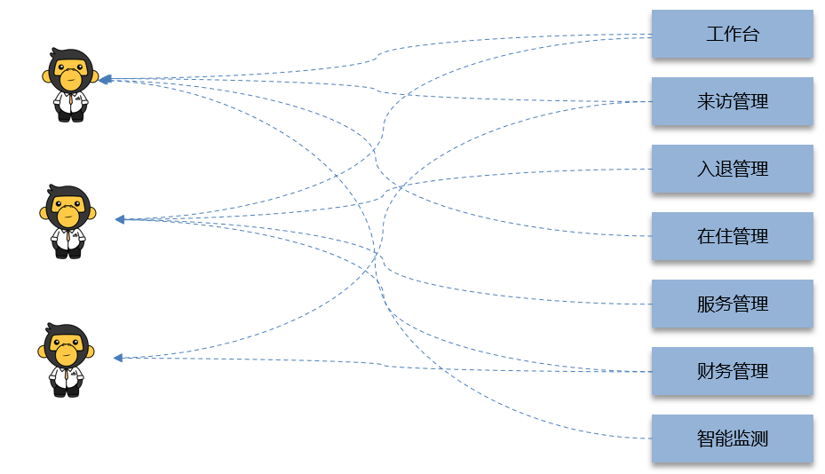
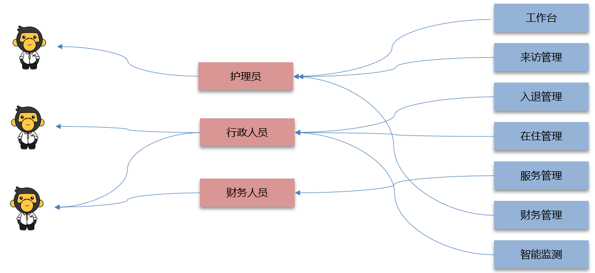
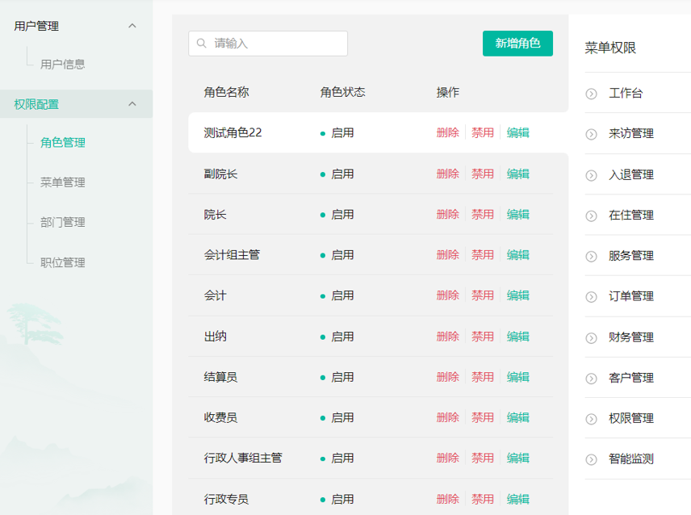
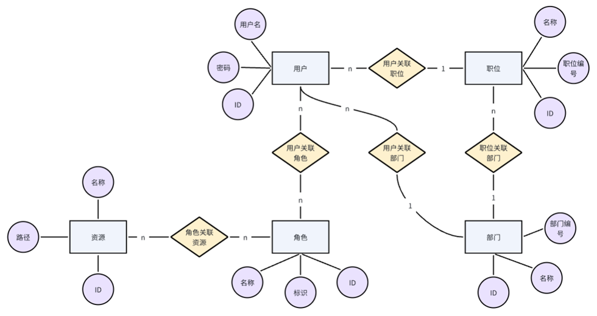
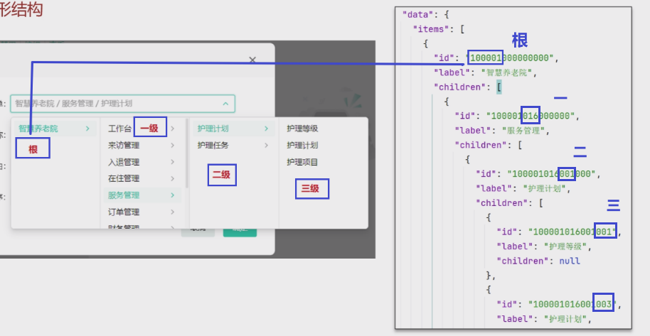
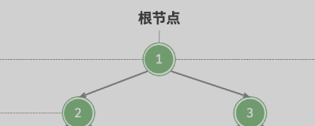
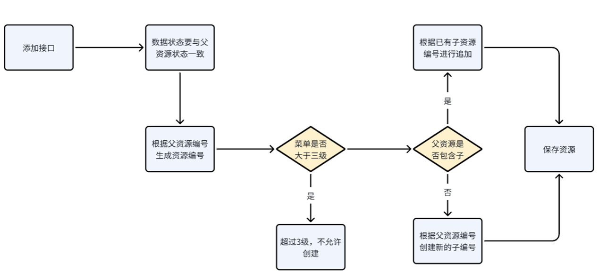
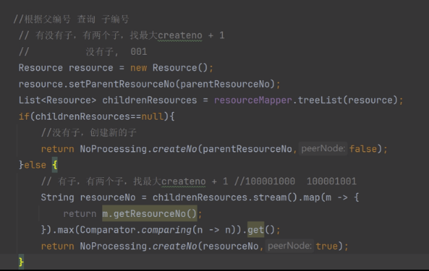

## 概览

> - 权限模块环境搭建，代码快速开发方式，资源管理功能开发
> - 角色管理和用户管理
> - 缓存优化-Redis基础
> - 安全框架-Spring Security
> - 项目基础Spring Security完成认证和授权


## RBAC模型

### 概述

> - **Role-Based Access Control**
> - **==基于角色的访问控制==**
>   - 主要是将功能组合成角色
>   - 再将角色分配给用户
> - **角色是功能的合集**
> - 它通过将权限与角色绑定，再将用户分配到相应角色的方式来控制用户对系统资源的访问。
> - RBAC简化了权限管理，尤其是在系统规模较大、用户和权限复杂的场景下。








## RBAC表结构

> - 用户表与角色表之间有关联表  --  多对多创建关联表
>
> - 角色与资源表之间有关联表 --  多对多创建关联表
> - 共5张表
>   - 职位与部门表是附带的




### 表结构说明

> - 表中  **==parent_resource_no==**  和  **==resource_no==**  是用于构建树形结构的基础
> - 通过这2个字段定义资源的上下级关系，通常添加资源菜单，我们通过 ==**程序自动生成编号**==，生成的编号满足以下规则:
>   - 1级：**==100==**000000000000
>   - 2级：100**==001==**000000000
>   - 3级：100001**==001==**000000
>   - 4级：100001001**==001==**000
>   - 5级：100001001001**==001==**





## 查询 -- **==like==**



### 查上级 -- 根

> - 结果是唯一数据 -- 根

```mysql
select * from sys_resource where resource_no like ‘子编号'
```

### 查下级 -- 所有子节点

> - 结果是一个集合 -- 子集

```mysql
select * from sys_resource where resource_no like ‘父编号'
```


## 核心概念

> - **用户（User）**：系统中的操作主体，通常是使用系统的人员。
> - **角色（Role）**：代表一组权限，通常与职位或职责相关联。一个角色可以拥有多个权限，多个用户可以被赋予同一个角色。
> - **权限（Permission）**：代表访问系统资源的具体操作，例如读取、写入、删除等。
>   - ==**权限是分配给角色的，而不是直接分配给用户**==
> - **资源（Resource）**：系统中的对象或数据，如文件、数据库表、API 接口等，用户通过权限访问这些资源。


## 基本思想

> - 通过将用户分配到特定的角色，**==间接地为用户赋予了访问某些资源的权限==**
> - ==**核心在于“角色”**==，而不是直接将权限赋予用户


## 递归树

> - 递归会在栈中开辟一块空间，若递归太深，容易 导致栈溢出，默认为1M

### 节点

#### TreeItemVo

```java
public class TreeItemVo implements Serializable {

    public String id;   
    public String label;

    // 递 -- 调用自己
    public List<TreeItemVo> children = new ArrayList<>();

    @Builder
    public TreeItemVo(String id, String label, List<TreeItemVo> children) {
        this.id = id;
        this.label = label;
        this.children = children;
    }
}
```

#### TreeVo

```java
public class TreeVo implements Serializable {

	@ApiModelProperty(value = "tree数据")
	private List<TreeItemVo> items;

	@Builder
	public TreeVo(List<TreeItemVo> items) {
		this.items = items;
	}
}
```


> - ?为什么以items作为返回值呢？只有一个根，返回TreeItemsVo不就行了？

## 流程



### 获取数据

> - 根节点编号：100001000000000
> - 根据根节点编号查出所有子孙节点，只差一次数据库，后续依据数据进行逻辑判断就好
>   - 用  **=="100001%"==**  来查询所有子孙节点


### 编号处理 

> - 目前已知的查询使用的是 like' 100001001 '
> - 在查询之前我们首先要知道编号100001001，并且对于10000100100这种我们需要做处理，去掉多余的0


### 子集ID




## 添加时编号处理

### 查询子集


### 若存在子集


### 不存在子集


## 代码快速生成 

> - AI工具自动生成
> - Mybatis Generator
> - 开源项目


