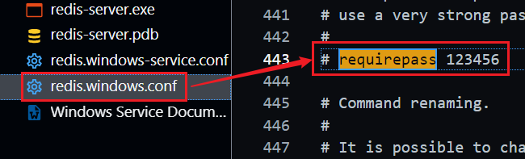
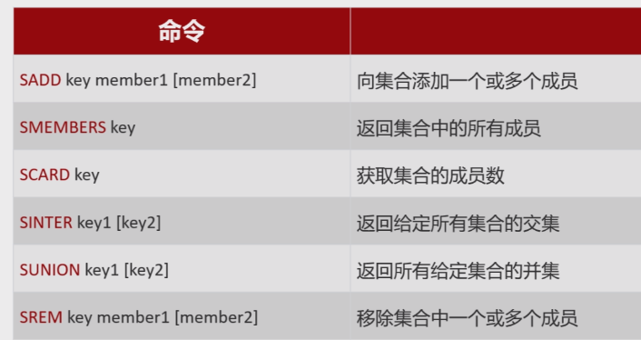
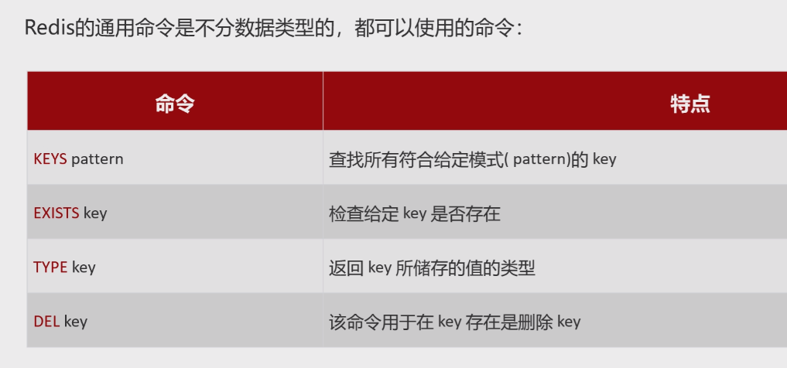

## 渊源

> - 随着Web 2.0的蓬勃发展，网站数据快速增长，对高性能读写的需求也越来越多，再加上半结构化的数据比重逐渐变大，人们对早已被铺天盖地地运用着的关系数据库能否适应现今的存储需求产生了疑问。


## 什么是Redis

> - 非关系型
>   - NoSql -- Not Only Sql
>   - 表与表之间没有关系 -- 老死不相往来
> - **==内存存储数据库==**
>   - 读取快
>     - 一秒十万个键值
>   - 存储数据量少
>     - **==热点数据==**
>       - 抢购
>   - 程序退出后内存中数据会消失
> - Redis虽然是作为数据库开发的，但由于其提供了丰富的功能，越来越多的人将其用作**==缓存、队列系统==**等
>   - 缓存
>     - 可以为每个键设置存活时间，存活时间到期后会自动删除
>   - 队列
>     - 且支持阻塞式读取，可以很容易地实现一个高性能的优先级队列。
> - Redis使用C语言开发，代码量只有3万多行。这

## 为什么学Redis

> - 学的大部分技术,诸如微服务和Redis等,都是为了**==减轻Mysql的访问压力==**


## 概述

> - 键值对形式存储数据
>   - Redis字典中的键值除了可以是字符串，还可以是其他数据类型。
>   - 到目前为止Redis支持的常用键值数据类型如下：
>     - String  --  字符串
>     - Hash  --  哈希
>     - List  --  列表
>     - Set  --  集合
>     - Zset  --  有序集合


## 启动与终止

### 启动

> - redis-cli 执行时会自动按照默认配置
>   - 地址：127.0.0.1
>   - 端口：6379
> - 自定义地址和端口
>   - redis-cli -h 127.0.0.1 -p 6379

### 终止

> - 考虑到Redis有可能正在将内存中的数据同步到硬盘中，**==强行终止==**Redis进程**==可能会导致数据丢失==**
> - 正确停止Redis的方式应该是向Redis发送  ``SHUTDOWN`命令
>   - 在 Redis 命令行界面  直接输入 `SHUTDOWN` 命令
>   - Redis 会停止接受新的连接，并在完成当前操作后关闭服务器


## 配置

> - 启用配置文件的方法是在启动时**==将配置文件的路径作为启动参数传递给redis-server==**

### 更改密码

#### 修改配置文件




#### cmd指定配置文件启动


## 五种常用基本数据类型


### String


#### 设置失效时间


#### 分布式锁 -- **==超慢现象==**


##### 为什么Redis可以上锁而mysql不可以

> - 因为Redis是第三方, 和任何一个服务都无关
>   - 相当于一个拦截器


### Hash


### list


### Set




### Zset


> - **==实时排名==**


**==通用==**




## cmd使用Redis

> - 查看所有的key
>   - keys pattern
>   - keys *  --  查询所有
> - 查看key的类型
>   - type key
>   - 使用对应类型的查询语句查看其值
>     - list -- lrange k 0 -1
>     - set  --  smembers k
>     - hash  --  hgetall k


## java使用Redis


### 导入依赖

```xml
     <!--Redis-->
        <dependency>
            <groupId>org.springframework.boot</groupId>
            <artifactId>spring-boot-starter-data-redis</artifactId>
        </dependency>
```

### 更改yml文件


### String

```java
		/*存储获取*/
        redisTemplate.opsForValue().set("name","ermu");
        String name = redisTemplate.opsForValue().get("name");
        System.out.println(name);

        /*失效*/
        redisTemplate.opsForValue().set("age","20",200, TimeUnit.SECONDS);

        /*锁*/
        Boolean b = redisTemplate.opsForValue().setIfAbsent("lock","maotai");
        System.out.println(b);
        Boolean b1 = redisTemplate.opsForValue().setIfAbsent("lock","maotai2");
        System.out.println(b1);
```

### Hash

```java
 		/*增取 -- Put----get*/
        redisTemplate.opsForHash().put("heima","zhangsan","oo");
        String name = (String) redisTemplate.opsForHash().get("heima", "zhangsan");
        System.out.println(name);

        /*获取所有key*/
        Set<Object> keys = redisTemplate.opsForHash().keys("heima");
        System.out.println(keys);

        /*获取所有value*/
        List<Object> values = redisTemplate.opsForHash().values("heima");
        System.out.println(values);

        /*删除*/
        redisTemplate.opsForHash().delete("heima","zhangsan");
```

### List

```java
		/*增取 -- Push----range*/
        redisTemplate.opsForList().leftPushAll("list","a","b","c");
        List<String> list = redisTemplate.opsForList().range("list", 0, -1);
        System.out.println(list);

        /*删除*/
        String leftPop = redisTemplate.opsForList().leftPop("list");
        System.out.println(leftPop);

        /*长度*/
        Long size = redisTemplate.opsForList().size("list");
        System.out.println(size);
```

### Set

```java
		/*增取 -- add----members*/
        redisTemplate.opsForSet().add("k1","a","b","c");
        Set<String> key1 = redisTemplate.opsForSet().members("k1");
        System.out.println(key1);

        /*数量 -- size*/
        Long size = redisTemplate.opsForSet().size("k1");
        System.out.println(size);

        /*交集 -- intersect*/
        redisTemplate.opsForSet().add("k2","a","b","c");
        redisTemplate.opsForSet().add("k3","b","d","e");
        Set<String> intersect = redisTemplate.opsForSet().intersect("k2", "k3");
        System.out.println(intersect);

        /*并集 -- union*/
        Set<String> union = redisTemplate.opsForSet().union("k2", "k3");
        System.out.println(union);

        /*删除 -- remove*/
        redisTemplate.opsForSet().remove("k1", "a");
        key1 = redisTemplate.opsForSet().members("k1");
        System.out.println(key1);
```

###  zset

```java
		/*增 -- add*/
        ZSetOperations<String, String> zSet = redisTemplate.opsForZSet();
        zSet.add("star","zhangsan",10);
        zSet.add("star","lisi",20);
        zSet.add("star","wangwu",30);
        Set<String> star = zSet.range("star", 0, -1);
        System.out.println(star);

        /*增加score*/
        zSet.incrementScore("star","zhangsan",10);
        System.out.println(star);


        /*删除 -- remove*/
        zSet.remove("star","zhangsan");
```

### common

```java
 		/*查询key*/
        Set<String> keys = redisTemplate.keys("*");
        System.out.println(keys);

        /*是否存在key*/
        Boolean hasKey = redisTemplate.hasKey("k1");

        /*type*/
        DataType k1 = redisTemplate.type("k1");
        System.out.println(k1);

        /*删除*/
        redisTemplate.delete("k1");
        Boolean hasKey2 = redisTemplate.hasKey("k1");
        System.out.println(hasKey2);
```


## 16个默认数据库


> - Redis是一个字典结构的存储服务器，而实际上一个Redis实例提供了多个用来存储数据的字典，客户端可以指定将数据存储在哪个字典中。
>   - **一个 Redis 实例**：一个运行中的 Redis 服务器进程，通常是**==单线程==**的。
> - 这与我们熟知的在一个关系数据库实例中可以创建多个数据库，所以可以将其中的每个字典都理解成一个独立的数据库。
> - 每个数据库对外都是以一个从0开始的递增数字命名，Redis默认支持16个数据库，可以通过配置参数databases来修改这一数字。
> - 客户端与Redis建立连接后会**==自动选择0号==**数据库，不过可以随时使用SELECT命令更换数据库，如要选择1号数据库：
>   - 
> - 然而这些以数字命名的数据库又与我们理解的数据库有所区别。
>   - 首先Redis不支持自定义数据库的名字
>     - 每个数据库都以编号命名，开发者必须自己记录哪些数据库存储了哪些数据。
>   - 另外Redis也不支持为每个数据库设置不同的访问密码，所以一个客户端要么可以访问全部数据库，要么连一个数据库也没有权限访问。
>   - 最重要的一点是多个数据库之间并不是完全隔离的
>     - 比如FLUSHALL命令可以清空一个Redis实例中所有数据库中的数据。
>   - 综上所述，**==这些数据库更像是一种命名空间，而不适宜存储不同应用程序的数据==**。
>  - 比如
>  - 可以使用0号数据库存储某个应用生产环境中的数据，
> - 使用1号数据库存储测试环境中的数据，
> - 但不适宜
>     - 使用0号数据库存储A应用的数据
>    - 而使用1号数据库存储B应用的数据，
>    - 不同的应用应该使用不同的Redis实例存储数据。
>    - 由于Redis非常轻量级，一个空Redis实例占用的内存只有1MB左右，所以不用担心多个Redis实例会额外占用很多内存。


## 业务中使用


### 查询

```java
    public User getById(Long id){
        /*1、查询redis，是否有数据*/
            //获取userid作为key
        String s = redisTemplate.opsForValue().get("user"+id);
        /*判断Redis中是否存在*/
        if (s == null) {
            /*若不存在，到数据库中查询*/
            User user = userMapper.getById(id);
            if (user == null) {
                throw new RuntimeException("用户不存在");
            }

            /*保存到Redis，直接返回*/
            redisTemplate.opsForValue().set("user"+user.getId(), JSON.toJSONString(user));
            return user;
        }

        return JSON.parseObject(s,User.class);
    }
```

### 删除

```java
/*删除*/
    public void deleteById(Long id){
        /*先删除Redis*/
        redisTemplate.delete("user-"+id);
        /*在删除数据库*/
        userMapper.deleteById(id);
    }
```

### 修改

```
/*redis修改和删除大致一致*/
/*无法修改，直接删，在重新从数据库缓存*/
```

### 缓存失效与更新

> - 在实际应用中，缓存需要随着数据变化进行更新或者删除。
> - Spring Cache 通过 `@CacheEvict` 实现缓存的失效，通过 `@CachePut` 实现缓存的更新。

####  缓存失效

> - **==当数据被更新或者删除时，我们通常需要将缓存中的数据也一同移除==**

#### 缓存更新

> - 使用 `@CachePut`在需要更新数据库的同时更新缓存

## 常见问题

### 缓存穿透

> - 如果请求的缓存项不存在，每次请求都会穿透缓存，直接查询数据库。
> - 可以通过将空结果缓存一段时间来避免频繁的数据库查询。

### 缓存雪崩

> - 当大量缓存同时失效时，可能会导致数据库负载过高。
> - 可以通过设置不同的缓存过期时间来缓解这个问题。

### 缓存击穿

> - 某个热点数据突然失效，导致大量请求直接打到数据库。可以使用加锁机制防止缓存击穿。


