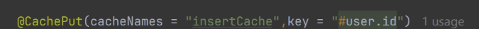
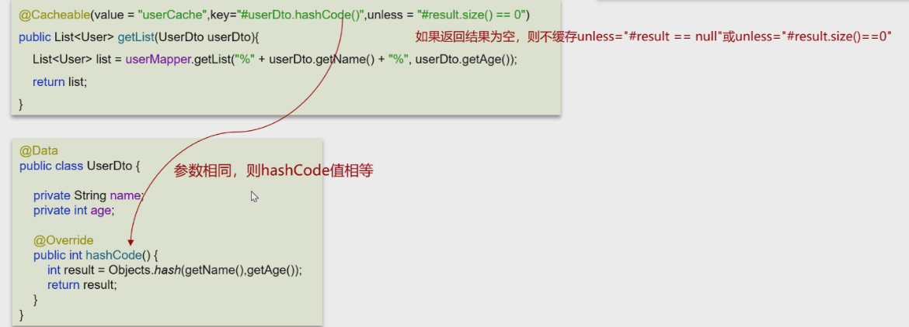
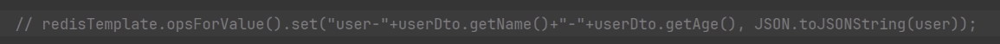
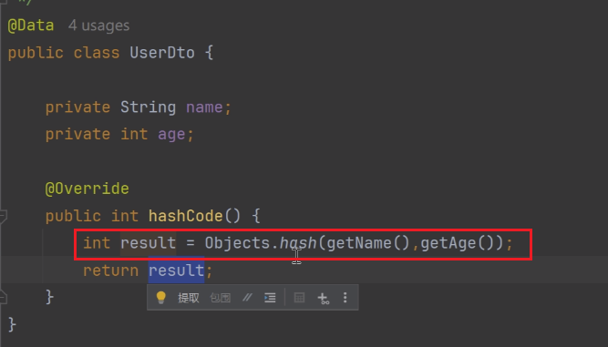
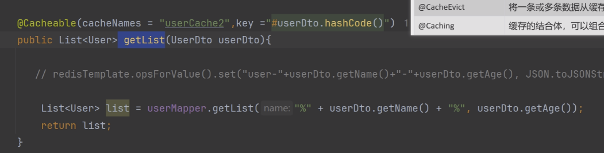
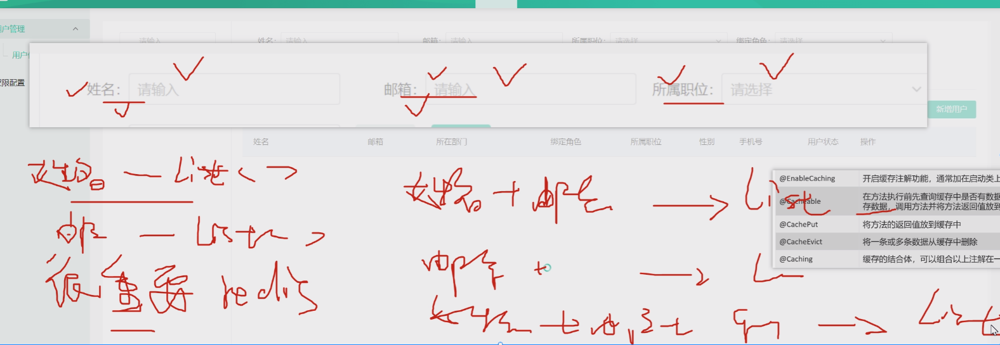
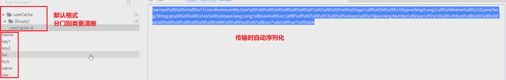
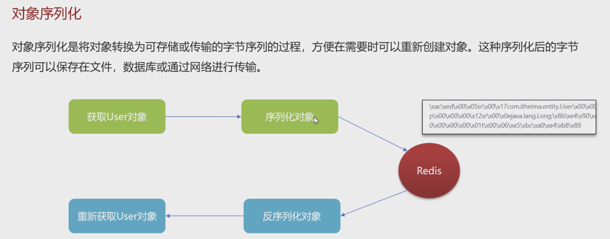

## 概述

> - 是 Spring Framework 提供的一种缓存抽象机制，允许我们将方法的返回结果存储到缓存中，
>   - **==减少重复的计算或数据库查询==**。
> - 其核心思想是在不修改业务代码的情况下，通过注解和配置引入缓存功能，从而提高应用的性能，**==不需要关心具体的缓存实现==**

## 核心概念

> - 缓存抽象
>   - Spring Cache 提供了一个通用的接口，开发者可以通过它以声明的方式管理缓存。具体的缓存实现（如 Redis、EhCache）通过配置或者注解使用，不影响代码逻辑。
> - 注解支持
>   - `@Cacheable`：标记方法的返回结果可以缓存，当再次调用该方法时，若缓存中有数据，则直接返回缓存内容，而不执行方法逻辑。
>   - `@CachePut`：用于方法执行后将返回结果放入缓存，每次都会执行方法逻辑并更新缓存。
>   - `@CacheEvict`：用于从缓存中移除特定的缓存项，可实现缓存的失效。
>   - `@Caching`：可以组合多个缓存操作，如 `@Cacheable`、`@CachePut` 等。
> - 缓存命名空间
>   - cacheNames 命名空间
>   - 
> - 缓存管理器

## 配置

### yml配置

```yml
spring:
  datasource:
    druid:
      driver-class-name: com.mysql.cj.jdbc.Driver
      url: jdbc:mysql://127.0.0.1:3306/cache_db?serverTimezone=Asia/Shanghai&useUnicode=true&characterEncoding=utf-8&zeroDateTimeBehavior=convertToNull&useSSL=false&allowPublicKeyRetrieval=true
      username: root
      password: 123456
  redis:
      host: 127.0.0.1
      port: 6379
      username:
      password:
```

### 依赖

```xml
<!-- Spring Boot 基本依赖 -->
<dependency>
    <groupId>org.springframework.boot</groupId>
    <artifactId>spring-boot-starter-cache</artifactId>
</dependency>

<!-- 选择具体的缓存实现（例如 Redis 或 EhCache）-->
<!-- Redis 作为缓存实现 -->
<dependency>
    <groupId>org.springframework.boot</groupId>
    <artifactId>spring-boot-starter-data-redis</artifactId>
</dependency>
```

## 启用

> - 在 Spring 中使用缓存，需要通过 `@EnableCaching` 注解来启用缓存支持。
> - 配置类中开启缓存
>   - 主类或者任意配置类中加上 `@EnableCaching`


## 缓存键生成

> - 缓存的键是用来标识缓存项的。
> - 默认情况下，缓存键基于方法参数自动生成，但你可以通过 `key` 属性自定义键的生成策略。

```java
@Cacheable(value = "users", key = "#id + '-' + #name")
public User findUserByIdAndName(Long id, String name) {
    // 业务逻辑
}
```


### 默认键生成策略

> - 如果不显式指定 `key`，Spring 会根据方法的**参数**自动生成缓存键
>   - 当方法只有一个参数时，该参数本身会作为缓存的键。
>   - 当方法有多个参数时，Spring 会将所有参数  **封装成一个数组**  作为键。

### 自定义键生成

> - Spring 缓存注解提供了 `key` 属性，用于**自定义生成缓存键**。
> - 你可以使用 SpEL（Spring Expression Language）表达式来指定键的生成规则，从而灵活地利用参数生成键。

#### 使用单个参数

> - ==**#id 表示将方法参数  id 作为缓存键**==

```java
@Cacheable(value = "users", key = "#id")
public User findUserById(Long id) {
    // 模拟耗时操作，比如查询数据库
    System.out.println("Fetching user from database...");
    return userRepository.findById(id);
}
```

#### 使用多个参数

> - `#lastName + '_' + #firstName` 是一个字符串拼接表达式，生成了类似 `"Smith_John"` 这样的缓存键。

```java
@Cacheable(value = "employees", key = "#lastName + '_' + #firstName")
public Employee getEmployeeByName(String firstName, String lastName) {
    // 缓存键为 "lastName_firstName"
    return employeeRepository.findByName(firstName, lastName);
}
```

#### 使用对象单个属性

> - `#employee.id` 表示使用 `employee` 对象的 `id` 属性作为缓存键。

```java
@Cacheable(value = "employees", key = "#employee.id")
public Employee getEmployee(Employee employee) {
    // 使用 employee 对象的 id 属性作为缓存键
    return employeeRepository.findById(employee.getId());
}
```

#### 使用对象的多个属性



##### 示例








### 多条件查询

#### 场景



> - 天猫大促查询，所有的查询组合结果都很重要（**==高频==**）


#### 使用结果

> - 有时，你可能希望使用方法执行结果作为缓存键。这通常在 `@CachePut` 注解中使用
> - 因为 `@CachePut` 不会跳过方法执行。你可以通过 `#result` 访问方法执行结果。

```java
@CachePut(value = "employees", key = "#result.id")
public Employee updateEmployee(Employee employee) {
    // 使用方法返回结果的 id 作为缓存键
    return employeeRepository.save(employee);
}
```

#### 特殊变量

```java
#root.methodName：表示当前方法名。
#root.method：表示当前方法对象。
#root.target：表示当前被调用的目标对象。
#root.args：表示当前方法的所有参数。
```

```java
@Cacheable(value = "employees", key = "#root.methodName + '_' + #id")
public Employee getEmployeeById(Long id) {
    // 缓存键为 "getEmployeeById_123"
    return employeeRepository.findById(id);
}
```

### 对象键冲突

> - 使用对象的多个属性直接拼接虽然是一个常见的方式，但==**不能绝对保证键的唯一性**==
> - 特别是在属性值较为相似的情况下，可能会出现键冲突的风险。
>   - 例如，如果有两个对象的属性拼接结果相同，虽然它们是不同的对象，但拼接后的键可能会一样，从而导致缓存的覆盖或误取。

> - 假设有两个不同的员工：
>
>   - Employee A: `firstName = "John"`, `lastName = "Smith"`
>   - Employee B: `firstName = "John_Smith"`, `lastName = ""`
>
>   对于这两个员工，拼接后的缓存键都是 `"John_Smith"`，这样会导致缓存键冲突。

```java
@Cacheable(value = "employees", key = "#employee.firstName + '_' + #employee.lastName")
public Employee getEmployee(Employee employee) {
    return employeeRepository.findByName(employee.getFirstName(), employee.getLastName());
}
```

#### ==**hashCode( )**==

> - 能够更加有效地保证键的唯一性，因为 `hashCode()` 方法在 Java 中会根据对象的内存地址或属性的值计算出一个唯一的哈希值。
>   - `hashCode()` 是基于对象的**属性值**生成的哈希码，而不是属性的字段名。
>   - 它的作用是返回一个整数，这个整数由对象的属性值经过某种算法计算得出，作为对象在哈希结构中的唯一标识
>   - 由你传入的查询条件（或方法参数）生成，用于唯一标识缓存中的某个数据条目。
>   - 这个键与缓存结果直接关联，确保相同的查询条件可以获取相同的缓存数据。
>   - **==特定搜索条件的结果集==**

```java
@Cacheable(value = "employees", key = "#employee.hashCode()")
public Employee getEmployee(Employee employee) {
    return employeeRepository.findById(employee.getId());
}
```

#### ==**Objects.hash( )**==

> - 如果你想要组合多个属性，并且避免键冲突，可以考虑使用 `Objects.hash()` 方法，该方法能够基于多个属性生成哈希值。

```java
@Cacheable(value = "employees", key = "T(java.util.Objects).hash(#employee.firstName, #employee.lastName, #employee.id)")
public Employee getEmployee(Employee employee) {
    return employeeRepository.findById(employee.getId());
}
```


## @Cacheable -- 查询

> - 用于启用缓存功能，帮助开发者自动缓存方法的**==返回结果==**
> - 它通过将方法的返回值存储在缓存中，以便下次调用同样的方法时可以直接从缓存中获取结果，而不是重新执行方法逻辑
> - `@Cacheable` 通常用于性能优化，尤其在耗时较长或资源密集型的操作上。
>   - 如果存在则直接返回缓存结果
>   - 如果不存在，执行方法逻辑并将结果缓存

```java
@Cacheable(value = "users")
public User findUserById(Long id) {
    // 数据库查询或其他耗时操作
    return userRepository.findById(id);
}
```

> - `findUserById` 方法的返回结果将会被缓存到名为 "users" 的缓存中。当再次调用该方法时，Spring 会检查是否已经缓存了相同的结果，如果存在则直接返回缓存内容。

### condition

> - 设置缓存条件,只有当条件为true时，结果才会缓存

```java
@Cacheable(value = "users", condition = "#id > 10")
public User findUserById(Long id) {
    return userRepository.findById(id);
}
```

### unless

> - 与 `condition` 相反，`unless` 属性用于指定不缓存的条件。当条件为 `true` 时，结果不会被缓存。

```java
@Cacheable(value = "users", unless = "#result == null")
public User findUserById(Long id) {
    return userRepository.findById(id);
}
```

### 工作流程

> - **检查缓存**：当方法被调用时，Spring 首先根据指定的 `key` 检查缓存中是否已有相应的值。
> - **返回缓存**：如果缓存中有结果，则直接返回缓存中的结果，而不执行方法逻辑。
> - **执行方法**：如果缓存中没有对应的值，则执行方法逻辑，生成结果。
> - **存储结果**：将生成的结果存入缓存中，以便下一次相同调用时直接使用。

### 使用场景

> - **数据库查询**：常见场景是在数据库查询时使用 `@Cacheable`，如查询用户、产品等信息时，可以避免重复查询数据库。
> - **计算结果缓存**：对于需要进行复杂计算的场景，可以通过缓存计算结果来提高性能。
> - **远程调用结果缓存**：对于外部 API 的调用，可以缓存结果，减少对外部系统的依赖。


## @CashPut -- 新增/更新

> - ==**它总是执行方法并更新缓存，无论缓存中是否已有值==**
>   - 在你希望  **每次调用方法时都更新缓存**  的场景中使用。
>   - 始终执行方法逻辑，并将**==方法的返回结果==**更新到缓存中
> - cacheNames，key，condition，unless结与 @Cashable用法相同

### 使用场景

> - 数据的**新增**、**更新**操作，这些操作需要立即反映到缓存中。

```javascript
@CachePut(value = "users", key = "#user.id")
    public User updateUser(User user) {
        return userRepository.save(user);
    }
```


### 注意点

> - **缓存更新的性能影响**：`@CachePut` 每次调用都会更新缓存，这可能会导致频繁的缓存更新操作，尤其是在高并发场景下。需要根据具体业务场景权衡性能和数据一致性问题。
> - **与 @Cacheable 的组合使用**：常常会在相同的业务逻辑中同时使用 `@Cacheable` 和 `@CachePut`。例如，读取时使用 `@Cacheable`，而更新时使用 `@CachePut` 来确保缓存中的数据是最新的。


## @Cacheable 和 @CashPut的区别与联系

### 区别

> - 如果你希望在调用方法时**==优先从缓存中读取结果==**而不是每次都执行方法时使用@Cacheable
>   - 不是每次都执行方法体
> - 如果你希望每次执行后都更新缓存，则使用 @CashPut
>   - 每次都执行方法体

### 联系

> - **==都是从返回值获取结果==**

## @CasheEvict -- 删除

### 概述

> - 用于从缓存中**移除数据**，移除缓存中的一个或多个条目
> - 它的作用是清除指定的缓存内容，以确保缓存中存储的数据是最新的
> - 适用于当缓存中的数据不再有效，或者当需要强制清除缓存的情况下使用

### 使用场景

> - 当系统中某些数据发生变化时，可能需要更新缓存，或者在某些情况下完全清除缓存中的某些或全部内容，这时就可以使用 `@CacheEvict`。

### 删除指定条目

> - 指定需要清除的缓存名称,**==?可以指定一个或多个缓存?==**
> - 在这个例子中，`deleteUser` 方法调用时，会从缓存 "users" 中删除指定的用户信息。

```java
@CacheEvict(value = "users")
public void deleteUser(Long id) {
    userRepository.deleteById(id);
}
```

### 删除指定key

> - 指定要从缓存中删除的键（Key）
> - 在这个例子中，只有缓存中键为 `id` 的条目会被删除

```java
@CacheEvict(value = "users", key = "#id")
public void deleteUser(Long id) {
    userRepository.deleteById(id);
}
```

### 删除命名空间所有条目

> - 如果设置为 `true`，将会清除缓存中的**所有条目**，而不仅仅是指定的键。默认值为 `false`。
> - 在该示例中，`deleteAllUsers` 方法会删除缓存 "users" 中的所有条目。

```java
@CacheEvict(value = "users", allEntries = true)
public void deleteAllUsers() {
    userRepository.deleteAll();
}
```

### 删除时机  --   **beforeInvocation**

> - 控制缓存清除操作的时机。默认情况下，缓存是在方法**执行之后**才进行清除。
> - 如果设置 `beforeInvocation = true`，则会在方法执行之前清除缓存。

```java
@CacheEvict(value = "users", key = "#id", beforeInvocation = true)
public void deleteUser(Long id) {
    if (id == null) {
        throw new IllegalArgumentException("ID cannot be null");
    }
    userRepository.deleteById(id);
}
```

### condition

> - 与 `@Cacheable` 一样，`condition` 用于指定一个 SpEL 表达式，只有当条件为 `true` 时才会触发缓存清除操作。

```java
@CacheEvict(value = "users", key = "#id", condition = "#id > 10")
public void deleteUser(Long id) {
    userRepository.deleteById(id);
}
```

### 使用场景

> - **数据删除时清除缓存**：
>   - 当应用删除某条数据时，缓存中的对应条目也应被删除，避免下次查询时仍然返回已删除的数据。
>   - 常见场景如用户删除、商品删除等。
> - **==数据更新时清除缓存==**： 
>   - 某些业务场景下，更新数据时可能需要清除缓存，而不是立即更新缓存。
>   - 通过清除缓存，下一次查询时可以重新加载最新数据。
> - **批量数据操作**： 
>   - 在批量删除或更新数据时，可能需要清除整个缓存，确保缓存中不再存在过期或无效的数据。

### 典型使用

#### 示例 1：删除特定的缓存条目

```java
public class UserService {

    @CacheEvict(value = "users", key = "#id")
    public void deleteUser(Long id) {
        userRepository.deleteById(id);
    }
}
```

- 在该示例中，`deleteUser` 方法不仅从数据库中删除用户，还会从 "users" 缓存中删除键为 `id` 的缓存条目。

#### 示例 2：清空整个缓存

```java
public class ProductService {

    @CacheEvict(value = "products", allEntries = true)
    public void clearProductCache() {
        // 一些其他的业务逻辑
    }
}
```

- 在该示例中，调用 `clearProductCache` 方法时，"products" 缓存中的所有条目都会被清空。

#### 示例 3：条件性清除缓存

```java
public class UserService {

    @CacheEvict(value = "users", key = "#id", condition = "#id > 10")
    public void deleteUser(Long id) {
        userRepository.deleteById(id);
    }
}
```

- 该示例中，只有当 `id` 大于 10 时，才会从缓存中删除对应的用户条目。

#### 示例 4：在方法执行前清除缓存

```java
public class OrderService {

    @CacheEvict(value = "orders", key = "#order.id", beforeInvocation = true)
    public void cancelOrder(Order order) {
        // 取消订单逻辑
        if (order.getStatus().equals("CANCELLED")) {
            throw new RuntimeException("Order already cancelled");
        }
        order.setStatus("CANCELLED");
        orderRepository.save(order);
    }
}
```

- 在该示例中，缓存会在 `cancelOrder` 方法执行之前被清除，即使方法中抛出了异常，缓存仍然会被清除。


## @Caching -- 组合

> - 可以组合多个缓存操作注解
> - 用于在**==同一个方法中应用多个缓存操作==**
> - 当你需要在一个方法中对缓存进行多个操作时（例如同时执行 `@Cacheable` 和 `@CacheEvict`），可以使用 `@Caching` 来组合这些操作。


## 传输序列化





