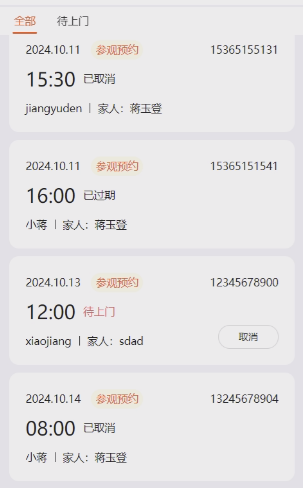

概述

> - 定时任务（Scheduled Tasks）是一种 **==自动化任务管理机制==**
> - **==允许系统在特定的时间间隔或指定的时间点自动执行预定义的操作==**   --  批量的定时任务
>   - 话费，高铁票，还款信息，发工资
> - 这种机制广泛应用于各种操作系统和应用程序中，以实现自动化和提高工作效率


## 用途

> - **自动化操作**
>   - 减少人工干预，定期执行重复性工作。
> - **定期备份**：
>   - 自动备份数据，确保数据安全和可恢复性。
> - **定时发送邮件**
>   - 例如，定期发送报告或通知。
> - **数据清理**
>   - 定期清理不必要的文件或记录，以节省存储空间。
> - **系统维护**
>   - 执行系统更新、清理缓存等操作。


## 实现选用 -- Spring task

### 概述

> - Spring Task 的主要功能包括：
>   - **定时任务**：能够在指定的时间间隔内执行特定的方法。
>   - **异步执行**：能够在不同的线程中异步执行方法，提升应用的并发处理能力。

### 使用流程

#### 依赖

```xml
<dependency>
    <groupId>org.springframework.boot</groupId>
    <artifactId>spring-boot-starter</artifactId>
</dependency>
```

#### 开启任务支持

> - 在 Spring Boot 应用的主类或配置类上 **添加 `@EnableScheduling` 和 `@EnableAsync` 注解**，以启用定时任务和异步任务的支持：

```java
@SpringBootApplication
@EnableScheduling
@EnableAsync
public class MyApplication {
    public static void main(String[] args) {
        SpringApplication.run(MyApplication.class, args);
    }
}
```

#### 定义定时任务

> - **使用 `@Scheduled` 注解来定义定时任务**。
> - 该注解可以放在任何 Spring 管理的 bean 的方法上。可以使用多种方式设置执行时间，包括固定频率、固定延迟和 Cron 表达式。
>   - 此任务 ==**无需返回值**==，因为此方法的返回值毫无作用

```java
import org.springframework.scheduling.annotation.Scheduled;
import org.springframework.stereotype.Component;

@Component
public class ScheduledTasks {

    // 每分钟执行一次
    @Scheduled(fixedRate = 60000)
    public void reportCurrentTime() {
        System.out.println("当前时间: " + System.currentTimeMillis());
    }

    // 每次执行间隔 5 秒
    @Scheduled(fixedDelay = 5000)
    public void taskWithDelay() {
        System.out.println("任务执行，延迟 5 秒: " + System.currentTimeMillis());
    }

    // 使用 Cron 表达式，每天中午 12 点执行
    @Scheduled(cron = "0 0 12 * * ?")
    public void scheduledWithCron() {
        System.out.println("定时任务执行: " + System.currentTimeMillis());
    }
}
```

#### 定义异步任务

> - 使用 `@Async` 注解，可以将某个方法标记为异步执行。异步方法会在独立的线程中执行，不会阻塞主线程。

```java
import org.springframework.scheduling.annotation.Async;
import org.springframework.stereotype.Service;

@Service
public class AsyncTasks {

    @Async
    public void asyncTask() {
        System.out.println("异步任务执行: " + Thread.currentThread().getName());
        try {
            Thread.sleep(3000); // 模拟任务执行
        } catch (InterruptedException e) {
            e.printStackTrace();
        }
        System.out.println("异步任务完成: " + Thread.currentThread().getName());
    }
}
```


## 注解统计

> - **@Scheduled**：用于定义定时任务的执行规则。
>   - `fixedRate`：指定从上一次开始到下次开始之间的时间间隔（毫秒）。
>   - `fixedDelay`：指定上一次完成后到下次开始之间的延迟时间（毫秒）。
>   - `cron`：使用 Cron 表达式定义复杂的调度规则。
> - **@EnableScheduling**：启用定时任务支持。
> - **@Async**：用于定义异步执行的方法。
> - **@EnableAsync**：启用异步任务支持。


## cron表达式

### 概述

> - Cron 表达式是一种用于定义定时任务执行时间的字符串格式
> - 它由六到七个字段组成，每个字段表示不同的时间单位，用户可以通过这些字段指定任务的具体执行时间。
> - 直接写值是具体的时间
>   - 5  50  10  *  *  ？
>   - 每天10点的 第50分 第5秒 执行
> - 频次用斜杠 / 

###  特殊字符

> - *****：表示“每个”值，例如在分钟字段中使用`*`表示每分钟。
> - **,**：用于分隔多个值，例如在月份字段中使用`1,3,5`表示在一月、三月和五月执行。
> - **-**：表示范围，例如在小时字段中使用`1-5`表示从1点到5点执行。
> - **/**：用于指定增量，例如在分钟字段中使用`*/15`表示每15分钟执行一次。
>   - 一般只有一个增量，保证唯一变量
> - **?**：在日和星期字段中使用，表示不指定具体值，通常用于与其他字段组合使用。
>   - **==星期和日不能同时存在==**  --  同级
>   - 我无法指定该天是星期几
> - **L**：在日和星期字段中使用，表示“最后”一天。例如，在月份字段中使用`L`表示当月的最后一天。
> - **W**：用于指定离给定日期最近的工作日，例如在日字段中使用`15W`表示在15号的最近工作日执行。
> - **#**：用于表示某个月的第几个星期几，例如`5#2`表示该月的第二个星期五。

## 6个字段

> - 秒  分  时  日  月  星期 [年]

| 字段      | 允许值        | 说明                                 |
| --------- | ------------- | ------------------------------------ |
| 秒        | 0-59          | 任务执行的秒数                       |
| 分        | 0-59          | 任务执行的分钟数                     |
| 时        | 0-23          | 任务执行的小时数                     |
| 日        | 1-31          | 任务执行的日期                       |
| 月        | 1-12或JAN-DEC | 任务执行的月份                       |
| 星期      | 0-7或SUN-SAT  | 任务执行的星期几（0和7都代表星期天） |
| 年 (可选) | 1970-2099     | 任务执行的年份                       |


1. **每分钟执行一次**：

   ```
   * * * * *
   ```

2. **每小时的第 5 分钟执行**：

   ```
   5 * * * *
   ```

3. **每天凌晨 1 点执行**：

   ```
   0 1 * * *
   ```

4. **每周一的凌晨 1 点执行**：

   ```
   0 1 * * 1
   ```

5. **每月的 1 号执行**：

   ```
   0 0 1 * *
   ```

6. **每天的 12:00 到 12:59 每 10 分钟执行**：

   ```
   0-59/10 12 * * *
   ```

7. **每月最后一天的 23:59 执行**：

   ```
   59 23 L * *
   ```

8. **每个工作日（周一到周五）执行**：

   ```
   0 12 * * 1-5
   ```


## 间隔选用

### **任务的性质**

> - **数据备份**：如果是关键数据的备份，建议至少每天进行一次，或根据数据的更新频率进行更频繁的备份（如每小时）。
> - **报告生成**：**如果报告需要实时或接近实时的数据，可以设置为每小时或每几分钟执行一次。**
> - **数据清理**：可以设置为每日、每周或每月，根据数据的增长和存储需求来决定

###  **系统资源**

> - **CPU 和内存负载**：频繁执行的定时任务可能会占用大量系统资源，影响系统的性能。在选择时间间隔时，应考虑当前系统的负载能力。
> - **数据库性能**：如果任务涉及数据库操作，确保选择的时间间隔不会造成数据库的负担，避免出现锁争用或性能瓶颈。

### **业务需求**

> - **业务高峰期**：在业务高峰期，可能需要减少定时任务的频率，以免影响用户体验。可以考虑在低峰期执行任务。
> - **用户需求**：根据用户对数据更新的需求来设定频率。例如，某些用户可能需要实时数据更新，而其他用户可能对延迟几小时的数据没有异议

###  **错误处理与监控**

> - **失败重试机制**：如果任务失败，可能需要设计重试机制。在这种情况下，可以适当延长时间间隔，以避免在短时间内频繁重试导致的额外负担。
> - **监控和日志**：定期监控定时任务的执行情况，记录日志以便分析。如果发现某个任务执行效率低或影响其他服务，可以适当调整时间间隔

###  **资源占用与任务完成时间**

> - **任务执行时间**：如果任务本身需要较长的执行时间，应相应地增加下次执行的时间间隔，以避免重复执行和资源冲突。
> - **并发执行**：如果系统支持并发执行，可以在时间间隔较短的情况下执行任务，但应监控并发带来的资源使用情况。

### 建议

> - **每分钟**：适用于需要频繁更新或监控的任务，如系统健康检查或实时数据处理。
> - **每小时**：适用于较高频率的数据同步、统计报告等。
> - **每日**：适合日常备份、数据清理等操作。
> - **每周或每月**：适合不频繁的任务，如系统维护、数据归档等。


## 案例

### 场景--预约过期




### 设置