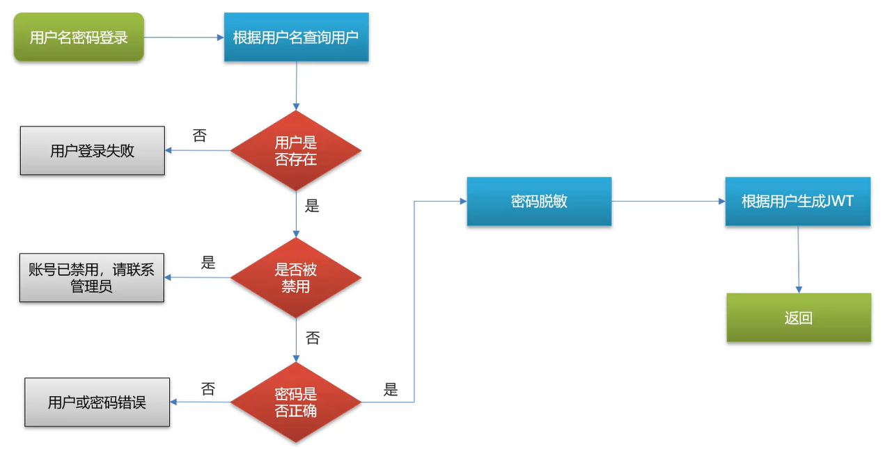
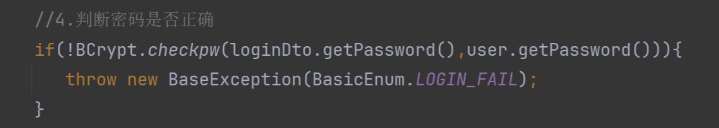
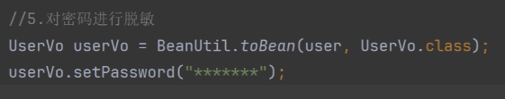
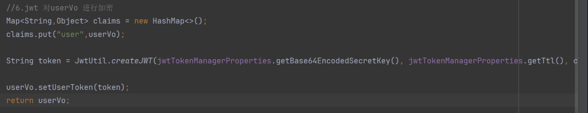
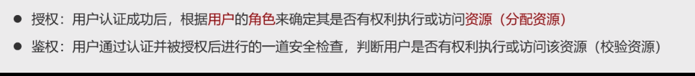
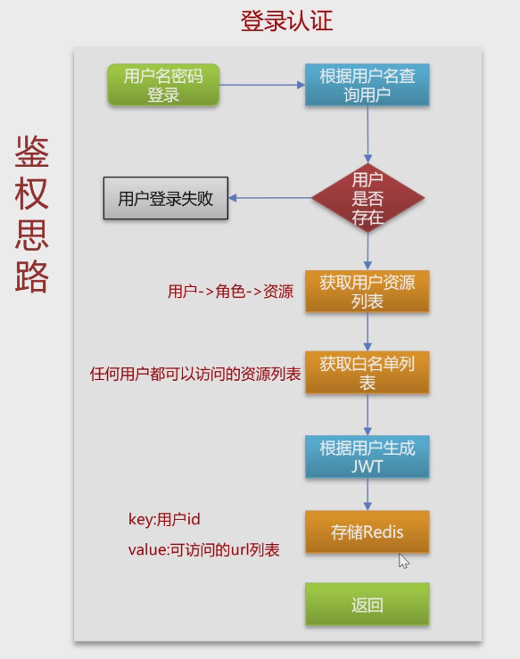
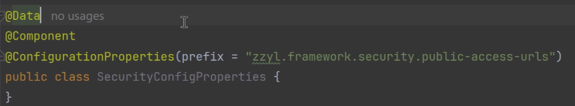
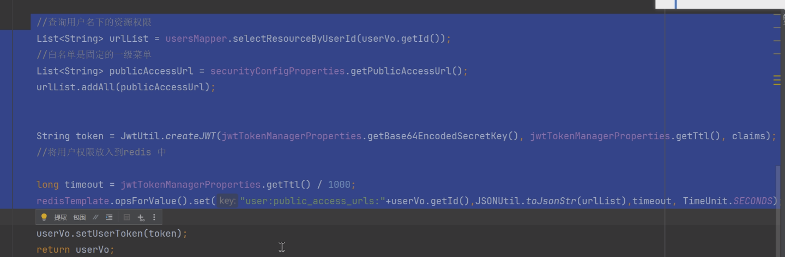
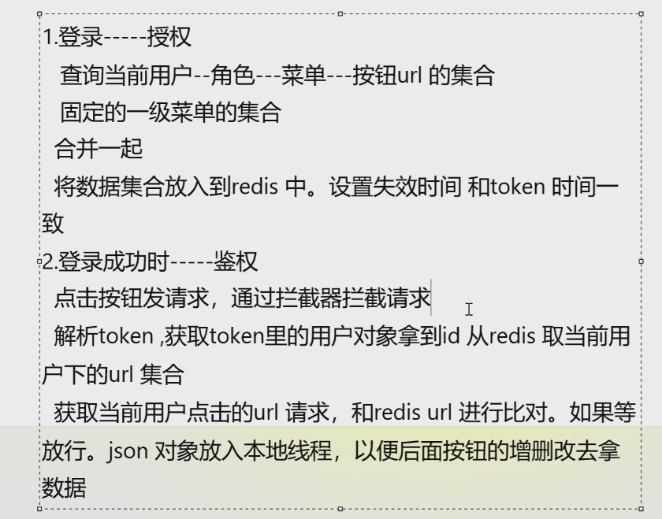

## 认证

> - 判断有没有此用户，身份确认
> - 

### 密码

#### 判断

#### 脱敏

## 鉴权

### 授权

> - 身份认证后进行授权

将所有按钮权限存在redis

`

### 鉴权

Control之前，拦截器，获取url来判断

​       获取token判断是否成功登录

​       共享资源

> - 包含关系的判定

## 动态菜单

